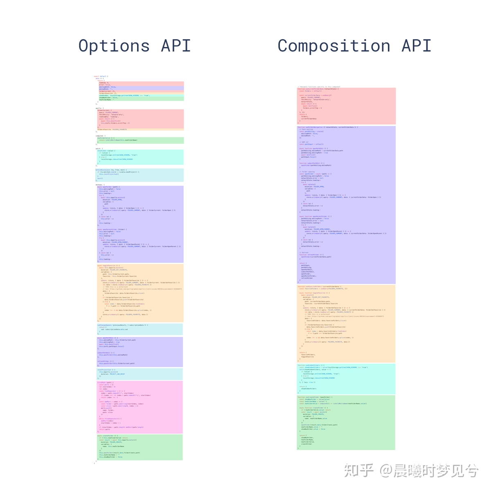
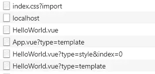

# Vue3.0与HOOKS

## Vue3.0正式版发布
- 已经发布两个月，历时两年开发

- 最大的变化
    1. Composition Api,全新的代码组织方式和状态管理方式
    2. 响应式原理改用proxy，对象属性的增删都能检测
    3. 全局tree-shaking，使用什么，打包什么
    4. 其它，TS重构源代码,移除部分api，编译优化

- 争议
    1. 杂七杂八一堆丢在一起，代码结构不清晰，语义不明确，无异于把vue自身优点都扔了，我还不如直接用react
    2. 抄袭 React？

<br><br><br><br><br><br><br><br><br><br>

## REACT  HOOKS

官方定义：
> 它可以让你在不编写 class 的情况下使用 state 以及其他的 React 特性

React以前的class组件，提供了state状态管理和各种生命周期函数

```js
    class Example extends React.Component {
        constructor(props) {
            super(props);
            this.state = {
                count: 0
            };
        }

        componentDidMount() { // do sth... }
 
        componentWillUnmount() { // do sth... }

        render() {
            return (
                <div>
                    <p>You clicked {this.state.count} times</p>
                    <button onClick={() => this.setState({ count: this.state.count ++ })}>
                    Click me
                    </button>
                </div>
            );
        }
    }
````

> 我们都知道react都核心思想就是，将一个页面拆成一堆独立的，可复用的组件，并且用自上而下的单向数据流的形式将这些组件串联起来。但假如你在大型的工作项目中用react，你会发现你的项目中实际上很多react组件冗长且难以复用。尤其是那些写成class的组件，它们本身包含了状态（state），以及各种生命周期钩子，所以复用这类组件就变得很麻烦。无论是封装成无状态组件还是使用高阶组件，都不能很难好的满足状态管理的需求，或者组件层级混乱难以理解。

> 还有典型的this指向问题，React中我们要经常写这样的代码：`this.handleClick = this.handleClick.bind(this)`，或者是这样的代码：`<button onClick={() => this.handleClick(e)}>`。一旦我们不小心忘了绑定this，各种bug就随之而来，很麻烦

React Hooks:
```js
import { useState } from 'react';

function Example() {
  const [count, setCount] = useState(0);

  return (
    <div>
      <p>You clicked {count} times</p>
      <button onClick={() => setCount(count + 1)}>
        Click me
      </button>
    </div>
  );
}
````

`useState`是react自带的一个hook函数，它的作用就是用来声明状态变量。useState这个函数接收的参数是我们的状态初始值（initial state），它返回了一个数组，这个数组的第[0]项是当前当前的状态值，第[1]项是可以改变状态值的方法函数。
所以我们做的事情其实就是，声明了一个状态变量count，把它的初始值设为0，同时提供了一个可以更改count的函数setCount

这样使整个Example变成了一个函数，就比class组件简单多了，逻辑复用也因此变得简单。除了useState外，还有很多别的hook，比如useEffect提供了类似于componentDidMount等生命周期钩子的功能，useContext提供了上下文（context）的功能等等，这里不做过多描述。

<br><br><br><br><br><br><br><br><br><br><br><br><br>

## Composition Api

开局一张图



在这张图中，Options API代表Vue2.x的选项式的代码组织方式，不同的色块代表着不同的功能点, 请问，你作为一个新接手的开发人员，能够在茫茫的 method、data、computed 等选项中一目了然的发现这个变量是属于哪个功能吗？反正我不能，往往需要再文档中Ctrl+F然后上下翻找，先是template, 然后data，然后computed，然后method......

Composition API就是将某个逻辑关注点相关的代码全都放在一个函数里，这样在修改一个逻辑时，只需要改那一块的代码了, 从状态定义到变更到使用，一目了然

### 一、setup

> `setup` 函数是一个新的组件选项。它作为在组件内部使用组合 API 的入口点。

  *vue不像react，直接返回的就是一个函数，vue返回的是一个对象，所以需要一个入口函数*

调用时间：
> 在创建组件实例时，在初始 prop 解析之后立即调用 setup。在生命周期方面，它是在 `beforeCreate` 钩子之前调用的

参数：
```js
setup(props, context) {
    context.attrs
    context.slots
    context.emit
}
````

### 二、reactive, ref

`reactive()`, 返回对象的响应式副本。响应式转换是“深”的——它影响所有嵌套 property。相当于Vue2中的`Vue.observable()`

```js
const obj = reactive({ count: 0 }) 
````

`ref()`, 接受一个一个独立的原始值 并返回一个响应式且可变的 ref 对象。ref 对象具有指向内部值的单个 `property .value`

```js
const count = ref(0)
console.log(count.value) // 0

count.value++
console.log(count.value) // 1
````

ref其实只是reactive的一种简化形式，接收的参数也可以是object，那么底层仍然调用`reactive`

*当 ref 作为渲染上下文 (从 `setup()` 中返回的对象) 上的 property 返回并可以在模板中被访问时，它将自动展开为内部值。不需要在模板中追加 `.value`，关于Ref展开有一点复杂，详情参考[官方文档](https://vue-docs-next-zh-cn.netlify.app/guide/reactivity-fundamentals.html)*

举个栗子：
```html
<template>
  <div>
    <span>{{ count }}</span>
    <button @click="count ++">Increment count</button>
  </div>
</template>

<script>
  import { ref } from 'vue'
  export default {
    setup() {
      const count = ref(0)
      return {
        count
      }
    }
  }
</script>
````

*除了reactive, ref还有些相应的api，如`unref`, `toRef`,`customRef`, `readonly`, `toRaw`等，参考[Refs文档](https://vue-docs-next-zh-cn.netlify.app/api/refs-api.html)和[reactive文档](https://vue-docs-next-zh-cn.netlify.app/api/basic-reactivity.html)*

跟`useState()`很像？是的
```js
// react hooks
const [count, setCount] = useState(0);

// vue hooks
const count = ref(0)
````

React Hook 和 Vue Hook 对比

> 1. 与React Hook不同，setup 函数仅被调用一次（响应式），这在性能上比较占优。React Hook在每一次渲染中都按照同样的顺序被调用
> 2. Vue Hook对调用顺序没什么要求
> 3. 不必考虑几乎总是需要`useCallback`的问题，以防止传递函数prop给子组件的引用变化，导致无必要的重新渲染
> 4. React Hook 有臭名昭著的闭包陷阱问题（甚至成了一道热门面试题，omg），如果用户忘记传递正确的依赖项数组，`useEffect`和`useMemo`可能会捕获过时的变量，这不受此问题的影响。Vue的自动依赖关系跟踪确保观察者和计算值始终正确无效
> 5. 不得不提一句，React Hook 里的「依赖」是需要你去手动声明的，而且官方提供了一个 eslint 插件，这个插件虽然大部分时候挺有用的，但是有时候也特别烦人，需要你手动加一行丑陋的注释去关闭它。

不得不说，青出于蓝而胜于蓝，vue虽然借鉴了react，但是天然的响应式数据，完美的避开了一些react hook遇到的短板~

hook一定是大前端的一个趋势，现在才是刚刚开始的阶段：`SwiftUI-Hooks`, `flutter_hooks`…


### 三、 为什么要用Refs(Hooks) ?

主要是为了解决逻辑复用的问题,Vue2.x中一般使用`Mixins`和`slot`，但是都有其缺点：

Mixins：
 > - 命名冲突
 > - 多个mixin时，上下文中属性的来源不清楚
 > - 不容易复用和扩展

Slots：
 > - 增加了缩进，降低代码可读性
 > - 暴露的属性只在模板中可用，降低灵活性
 > - 需要存在多个组件实例，性能更低

Hooks的优势：
> - 暴露给模板的属性具有明确的来源，因为它们是从 Hook 函数返回的值。
> - Hook 函数返回的值可以任意命名，因此不会发生名称空间冲突。
> - 没有创建仅用于逻辑重用的不必要的组件实例，返回值可以模板读取，也可以其它组件直接调用

### 四、自定义Hook(逻辑提取)

举个栗子：
```js
// 基于组合api 的解决方案
function useMouse() {
  const x = ref(0)
  const y = ref(0)
  const update = e => {
    x.value = e.pageX
    y.value = e.pageY
  }
  onMounted(() => {
    window.addEventListener('mousemove', update)
  })
  onUnmounted(() => {
    window.removeEventListener('mousemove', update)
  })
  return { x, y }
}

// 在组件中使用该函数
const Component = {
  setup() {
    const { x, y } = useMouse()
    // 与其它函数配合使用
    const { z } = useOtherLogic()
    return { x, y, z }
  },
  template: `<div>{{ x }} {{ y }} {{ z }}</div>`
}
````
吐槽逻辑全部放在`setup()`里面会造成意大利面条式代码？不存在的

### 五、生命周期和计算、监听
- `setup()`内有自己的生命周期，但几乎都是在Vue实例的生命周期前面加上`on`：
    ```js
        beforeCreate -> setup()
        created -> setup()
        beforeMount -> onBeforeMount
        mounted -> onMounted
        beforeUpdate -> onBeforeUpdate
        updated -> onUpdated
        beforeDestroy -> onBeforeUnmount
        destroyed -> onUnmounted
        errorCaptured -> onErrorCaptured
    ````
    *问： 那么当`mounted`和`onMounted`同时定义时，谁先执行？*

- computed:
    ```js
    import { computed, ref } from 'vue'

    const count = ref(1)
    const plusOne = computed(() => count.value + 1)
    ```
- watchEffect:

    在响应式地跟踪其依赖项时立即运行一个函数，并在更改依赖项时重新运行它
    ```js
    import { ref, watchEffect } from 'vue'

    const count = ref(0)
    watchEffect(() => console.log(count.value))
    // -> logs 0
    setTimeout(() => {
        count.value++
        // -> logs 1
    }, 100)
    ````
- watch
    ```js
    import { ref, watch } from 'vue'
    // 侦听一个ref
    const count = ref(0)
    watch(count, (count, prevCount) => {
        /* ... */
    })

    // 侦听多个源
    watch([fooRef, barRef], ([foo, bar], [prevFoo, prevBar]) => {
        /* ... */
    })
    ````
### 六、与现有的 API 配合
- 组合式 API 会在 2.x 的选项 (data、computed 和 methods) 之前解析，并且不能提前访问这些选项中定义的 property
- `setup()` 函数返回的 property 将会被暴露给 `this`。它们在 2.x 的选项中可以访问到

### 七、对我们编码日常的主要影响

1. 全局 API

    从技术上讲，Vue 2 没有“app”的概念，我们定义的应用只是通过 new Vue() 创建的根 Vue 实例。Vue3引入了新了全局API用来创建多个“app”：`createApp`

    ```js
    import { createApp } from 'vue'
    const app = createApp({})
    ````

    | 2.x 全局 API | 3.x 实例 API 
    |----- | ----
    |Vue.config	| app.config
    |Vue.filter | removed（用方法或计算属性）
    |Vue.config.productionTip | removed
    |Vue.config.ignoredElements	| app.config.isCustomElement
    |Vue.component | app.component
    |Vue.directive | app.directive
    |Vue.mixin | app.mixin
    |Vue.use | app.use (注意插件开发)

    还有比如`Vue.nextTick()`因为Treeshaking也不再支持，只能作为ES模块从vue导出，需要手动引入：
    ```js
    import { nextTick } from 'vue'
    nextTick(() => {
    // 一些和DOM有关的东西
    })
    ````

2. Data 选项

    在 2.x 中，开发者可以定义 data 选项是 object 或者是 function，在3.0中统一为只接受一个返回object的function
    ```js
    const app = new Vue({
        data() {
            return {
                apiKey: 'a1b2c3'
            }
        }
    })
    ````

    并且，来自Mixins的`data`数据，在2.x中是深合并，在3.0中是浅合并(直接替换整个对象)

3. 在 Vue 3 中，组件现在正式支持多根节点组件，即片段！

    ```html
    <!-- Layout.vue -->
    <template>
        <header>...</header>
        <main v-bind="$attrs">...</main>
        <footer>...</footer>
    </template>
    ````
    为什么？？

4. `render`函数不再提供参数`h`，而是全局导入

    ```js
    import { h } from 'vue'
    ````

5. slot

    2.x中的`slot` 和 `slot-scope`属性被彻底删除，用`v-slot`指令代替
    ```html
    /* 废弃 */
    <slot-example>
        <template slot="default" slot-scope="slotProps">
            {{ slotProps.msg }}
        </template>
    </slot-example>
    ````

7. v-if 与 v-for 的优先级

    2.x 版本中在一个元素上同时使用 v-if 和 v-for 时，v-for 会优先，3.0中则<b>相反</b>，需要特别注意。尽量避免他们作用在同一个元素上

8. vue-router

    ```js
    import { createRouter, createWebHistory } from 'vue-router'
    import Home from '../views/Home.vue'
    import Contact from '../views/Contact.vue'

    const routerHistory = createWebHistory()

    const router = createRouter({
        history: routerHistory,
        routes: [
          {
            path: '/',
            component: Home
          },
          {
            path: '/contact',
            component: Contact
          }
        ]
    })

    export default router
    ````

    ```js
    import router from './router'

    const app = createApp(App)
    app.use(router)
    app.mount('#app')
    ````

8. vuex

    基本没变

9. setup中如何访问`$router`和`$store`

    方法一、 Vue 3.0 中通过 `getCurrentInstance` 方法获取当前组件的实例，然后通过 ctx 属性获得当前上下文，`ctx.$router` 是 Vue Router 实例，里面包含的 `.currentRoute` 可以获取到当前的路由信息。`ctx.$store`获取vuex信息
    ```js
    import { getCurrentInstance } from 'vue'
    const { ctx } = getCurrentInstance()
    const $router = ctx.$router
    const $store = ctx.$store
    ````

    方法二、 使用各自的HOOKS
    ```js
    import { useRoute, useRouter } from 'vue-router'
    const $router = useRouter()
    const $route = useRoute()
    ````
    ```js
    import { useStore } from 'vuex'
    const $store = useStore()
    ````

<br><br><br><br><br><br><br><br><br><br><br><br><br>

## 不得不提的Vite

Vite 是一个由原生 ESM 驱动的 Web 开发构建工具。在开发环境下基于浏览器原生 ES imports 开发，在生产环境下基于 Rollup 打包。目前仅支持Vue3.0

它主要具有以下特点：
- 快速的冷启动，不需要等待打包操作
- 即时的模块热更新，替换性能和模块数量的解耦让更新飞起
- 真正的按需编译，不再等待整个应用编译完成，这是一个巨大的改变

原理：



vite使用Koa构建的服务端，处理`import`的资源路径，将处理的template,script,style等所需的依赖以http请求的形式，通过query参数形式区分并加载SFC文件各个模块内容，然后根据type调用不同的`compile`方法解析内容。

webpack之类的打包工具会把各种各样的模块提前打包进bundle中，但打包结果是静态的，不管某个模块的代码是否用得到，它都要被打包进去，显而易见的坏处就是随着项目越来越大，打包文件也越来越大。vite的优雅之处就在于需要某个模块时动态引入，而不是提前打包，自然而然提高了开发体验
